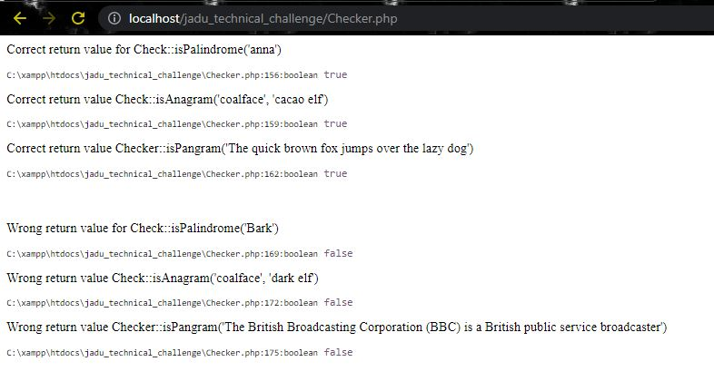

## How to run the program :
1. To run the program successfully, you will need a server software called XAMPP.          

2. Clone the repo into this directory on your machine : `c:/xampp/htdocs/`       

3. Navigate into the newly cloned repo : `c:/xampp/jadu_technical_challenge/`    

4. The directory should contain a script called `Checker.php`. This script is a class
called `Checker`. 
   

5. With `PHP` started using `XAMPP`, copy and paste this into your browser : `localhost/jadu_technical_challenge/Checker.php`

6. Finally, you should see a similar screen like the one below

## Time allocation for this exercise :
I spent about 5mins writing the algorithms for all three methods on a piece of paper.

I spent 30mins in writing all the methods and also refactoring them.